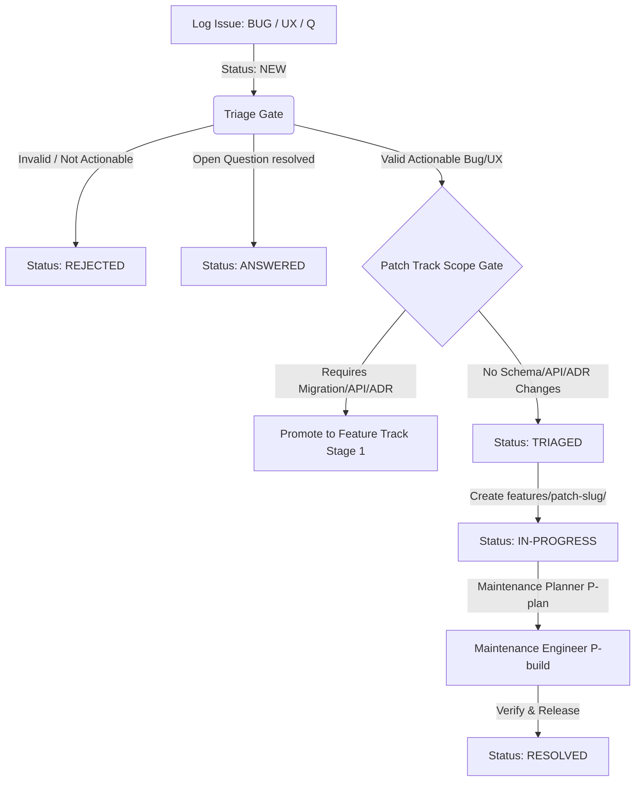

# issues/ — Unified Issue Registry & Triage Hub

This directory acts as the central intake valve and registry for all **Bugs, UX/Design Issues, and Open Questions** in the repository. By unifying these categories under one section, we maintain a single source of truth for repository health and outstanding decisions before routing them to either the **Feature Track** or the **Patch Track** (defined in [CLAUDE.md](../CLAUDE.md) §2).

---

## 1. Issue Types & Prefixes

We categorize and track intake items using distinct prefixes to ensure they receive the correct level of detail and routing:

| Prefix | Type | Description | Target Pipeline / Route |
| :--- | :--- | :--- | :--- |
| `BUG-` | **Bug Report** | Functional defects or errors where the system behaves incorrectly. | Patch Track (if no schema/API changes) or Feature Track. |
| `UX-` | **UX/Design Issue** | Usability gaps, visual polish debt, layout flaws, or flow improvements. | Patch Track (if simple CSS/HTML tweaks) or Feature Track. |
| `Q-` | **Open Question** | Architectural ambiguities, technical questions, or unresolved product decisions. | Strategic discussion -> update `STRATEGY.md` or active feature `OPEN_QUESTIONS.md`. |

---

## 2. Issue Lifecycle & Triage



1. **Log**: Create a new Markdown file in this directory (e.g., `BUG-002.md`, `UX-001.md`, or `Q-001.md`) using the appropriate template below. Set its status to `NEW`.
2. **Triage**: The Coordinator reviews the issue:
   - **Questions (`Q-`)** are discussed, answered, and marked `ANSWERED`. If they lead to product decisions, they are logged in `DECISIONS.md` or `STRATEGY.md`.
   - **Bugs/UX (`BUG-` / `UX-`)** are evaluated against the **Patch Track Scope Gate** (no migrations, no public API changes, no global ADR updates).
     - If it fits the Patch Track, set status to `TRIAGED`, assign a `patch-` slug, and create its patch folder. Set status to `IN-PROGRESS`.
     - If it violates the gate, promote it to the Feature Track (create `features/slug/` and set `Stage: 1-define`).
3. **Resolution**: Once released, update the issue status to `RESOLVED` (or `ANSWERED` for questions) and link the corresponding release or feature.

---

## 3. Unified Issues Registry

Every issue logged in this directory must have a corresponding row in this table.

| ID | Type | Date Reported | Reporter | Summary | Severity / Priority | Status | Issue File | Associated Path / Link |
| :--- | :--- | :--- | :--- | :--- | :--- | :--- | :--- | :--- |
| `BUG-000` | Bug | 2026-06-28 | QA Team | App detail page profile link broken when anonymous | Medium | `RESOLVED` | [`BUG-000.md`](BUG-000.md) | [`features/patch-anonymous-profile-link/`](../features/patch-anonymous-profile-link/) |
| `BUG-001` | Bug | 2026-06-28 | Developer / QA Team | Interest picker duplicate subcategories label click highlights previous occurrence | Medium | `NEW` | [`BUG-001.md`](BUG-001.md) | `TBD` |
| `UX-001` | UX | 2026-06-28 | QA Team / UX | Mobile touch target sizes for catalog search filters are too small | Medium | `NEW` | [`UX-001.md`](UX-001.md) | `TBD` |
| `UX-002` | UX | 2026-06-28 | Developer / User | App registration tags selection is overwhelming and niche selection is difficult | Medium | `NEW` | [`UX-002.md`](UX-002.md) | `TBD` |
| `Q-001` | Question | 2026-06-28 | Developer / QA Team | Duplicate vs. Unique Interest Subcategories Design Choice | Medium | `NEW` | [`Q-001.md`](Q-001.md) | `TBD` |


---

## 4. Templates

### Bug Report Template (`BUG-XXX.md`)
```markdown
### `BUG-XXX`: [Short Summary of the Defect]

- **Reporter:** [Your Name / Team]
- **Date Reported:** YYYY-MM-DD
- **Severity:** [Critical (Blocker) / High / Medium / Low]
- **Status:** `NEW`
- **Patch/Feature Slug:** `TBD`

#### Description & Impact
[Provide a clear description of what is happening and the impact on the user or system.]

#### Steps to Reproduce
1. [Go to...]
2. [Click on...]
3. [Observe...]

#### Expected Behavior
[What should have happened instead.]

#### Actual Behavior & Details
[What actually happened. Paste traceback, error codes, logs, console output, or screenshots here.]
```

### UX/Design Issue Template (`UX-XXX.md`)
```markdown
### `UX-XXX`: [Short Summary of the Usability/Visual Issue]

- **Reporter:** [Your Name / Team]
- **Date Reported:** YYYY-MM-DD
- **Priority:** [High / Medium / Low]
- **Status:** `NEW`
- **Patch/Feature Slug:** `TBD`

#### UX Observation
[Describe the usability gap, visual polish debt, layout inconsistency, or flow friction.]

#### Impact & User Friction
[How does this affect the user experience? E.g., cognitive load, visual confusion, missed calls to action.]

#### Suggested Improvement
[Describe the recommended visual design change, layout adjustment, or interactive refinement.]

#### Visual References / Markup
[Paste CSS selectors, HTML snippets, class names, or wireframe references if applicable.]
```

### Open Question Template (`Q-XXX.md`)
```markdown
### `Q-XXX`: [Short Summary of the Question]

- **Reporter:** [Your Name / Team]
- **Date Reported:** YYYY-MM-DD
- **Category:** [Architecture / Product / Strategy / Tech Stack]
- **Status:** `NEW`

#### The Question / Ambiguity
[State the clear question or ambiguity that needs to be addressed.]

#### Context & Alternatives
[Provide background context on why this question arises and the different alternatives/options under consideration.]

#### Proposed Resolution / Answer (To be filled during triage)
[Once discussed and resolved, record the final answer, decision rationale, and link to any global ADR or STRATEGY.md updates.]
```
